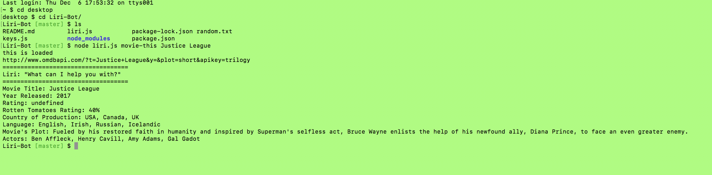

# Liri-Bot
### Overview
LIRI is a Language Interpretation and Recognition Interface, just like Iphone's SIRI. However, LIRI is a command line node app that takes in parameters and gives you back some data.

